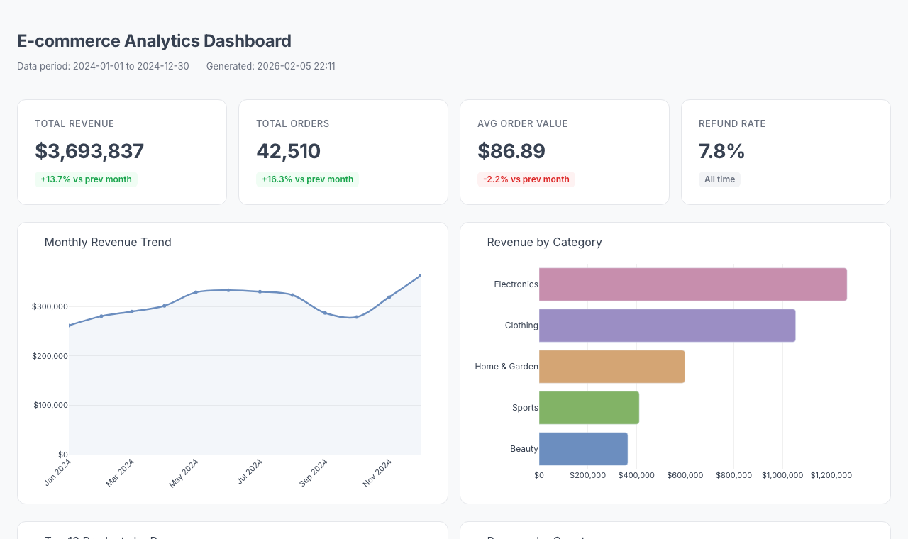

# E-commerce Analytics Pipeline

Python pipeline that takes raw e-commerce order data (50K+ transactions), cleans and processes it, calculates key business metrics, and generates an interactive dashboard — all in one script run.

**[Live Dashboard Demo](https://romaniumsss.github.io/ecom-analytics-pipeline/)**



## What It Does

- **Data Generation** — realistic e-commerce dataset: 50K orders, 12K customers, 5 categories, 6 countries, seasonal patterns
- **ETL Pipeline** — cleans messy data (duplicates, missing values, mixed date formats), calculates KPIs, aggregates metrics
- **Interactive Dashboard** — single HTML file with plotly charts: revenue trends, category breakdown, top products, geographic split, customer cohorts

## Key Metrics

| Metric | Value |
|---|---|
| Total Revenue | $3.69M |
| Total Orders | 42,510 |
| Avg Order Value | $86.89 |
| Refund Rate | 7.8% |

## Quick Start

```bash
pip install -r requirements.txt

python generate_data.py    # generates data/raw_orders.csv
python pipeline.py         # processes data → output/metrics.json
python dashboard.py        # builds output/dashboard.html
```

## Stack

Python, pandas, plotly, Faker, Jinja2
